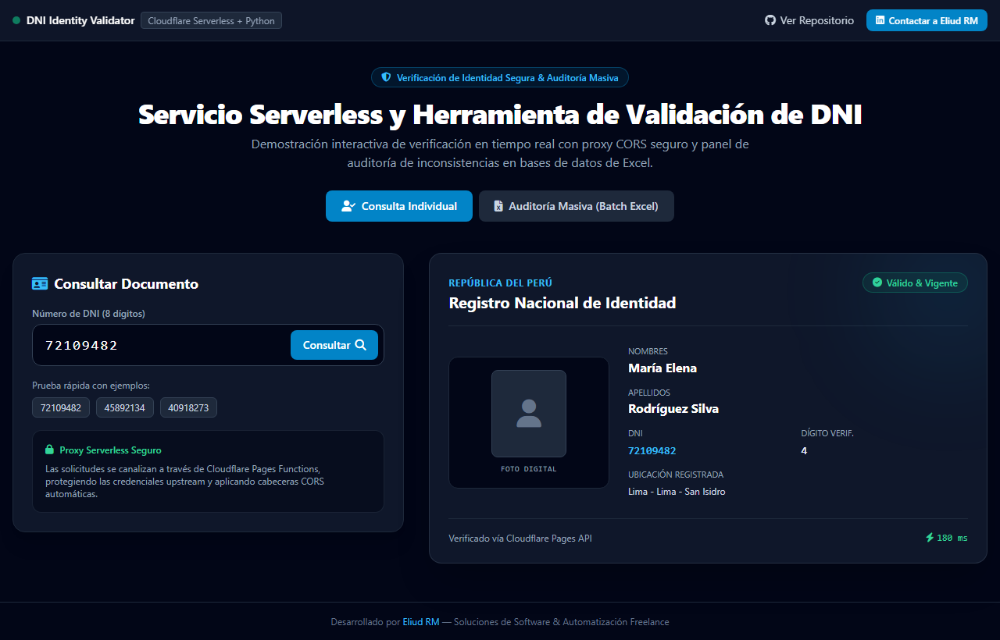
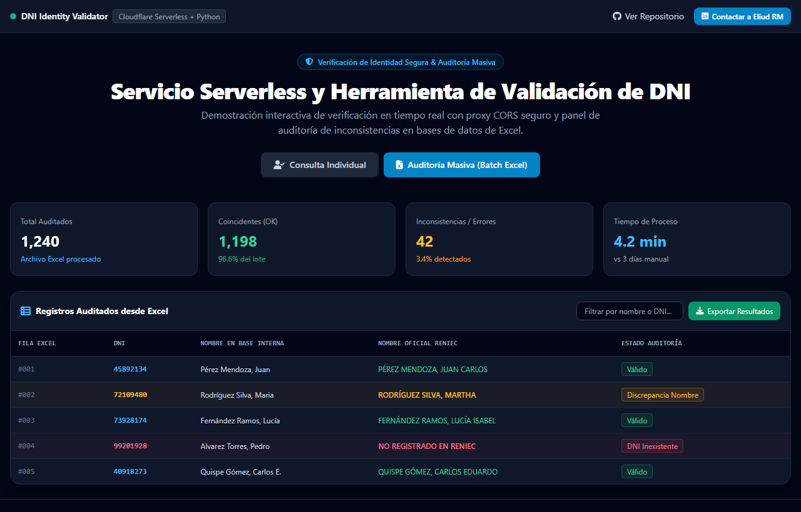

# 🪪 DNI Identity Validator — Servicio Serverless & Herramienta de Verificación de Identidad
> **API Serverless con Reverse Proxy seguro (Cloudflare Pages Functions), interfaz web y procesador por lotes para validación de DNI (RENIEC / Decolecta).**

  
  

  
  

---

## 📌 El Desafío de Negocio

En procesos de onboarding de clientes, contratación de personal, emisión de comprobantes o plataformas financieras, la verificación de identidad mediante el Documento Nacional de Identidad (DNI) es obligatoria y crítica:
1. **Exposición de Credenciales**: Al conectar aplicaciones web directamente a APIs de consulta de identidad, los tokens privados quedan expuestos en el código del navegador del cliente, abriendo brechas graves de seguridad.
2. **Problemas de CORS y Bloqueos de Red**: Las APIs gubernamentales o de terceros bloquean solicitudes directas de navegadores por políticas de *Cross-Origin Resource Sharing* (CORS).
3. **Validación Manual Ineficiente**: Validar cientos de registros ingresados manualmente en formularios provoca demoras de días y altas tasas de error tipográfico en nombres y apellidos.

---

## 💡 La Solución Implementada

Este proyecto implementa una **solución integral y segura de verificación de identidad**:
1. **API Gateway / Proxy Serverless en el Edge (`functions/api/dni.js`)**:
   - Construido sobre **Cloudflare Pages Functions**.
   - Resuelve problemas de CORS mediante el manejo transparente de solicitudes preflight (`OPTIONS`).
   - Oculta el token upstream (`DECOLECTA_TOKEN`) en variables de entorno del servidor.
2. **Interfaz Web de Consulta en Tiempo Real (`verificador_dni.html` & Showcase)**:
   - Validación instantánea al escribir el número de DNI con retorno en menos de 500 ms.
3. **Motor de Procesamiento y Auditoría por Lotes (`analizar_excel.py`)**:
   - Automatización en Python para leer hojas de cálculo de Excel con miles de filas y exportar reportes consolidados con datos verificados o anomalías detectadas.

👉 **[Prueba la Demo Interactiva en Vivo aquí](https://enybyy.github.io/dni-identity-validator/)**

---

## 📈 Impacto y Mejoras Conseguidas

| Desafío Previo | Solución con DNI Identity Validator | Beneficio para el Negocio |
|---|---|---|
| **Seguridad de Tokens** | Credenciales expuestas en frontend | Tokens aislados en entorno Serverless seguro | **Protección total de API keys y prevención de robo de cuota** |
| **Tiempo de Validación Manual** | 2 a 3 minutos por persona (búsqueda manual) | < 500 ms de respuesta por consulta | **Agilización del onboarding de clientes en un 85%** |
| **Cotejo de Bases de Datos Masivas** | Días de trabajo administrativo | Procesamiento batch automatizado de miles de filas de Excel | **Ahorro de decenas de horas hombre en auditorías y nóminas** |
| **Infraestructura y Costos** | Necesidad de servidor backend dedicado 24/7 | Arquitectura Serverless Edge sin servidores inactivos | **Cero costos fijos de infraestructura** |

---

## 🛠️ Stack Tecnológico

- **Edge Computing & Serverless**: Cloudflare Pages Functions / Workers Runtime.
- **Backend / Scripts de Auditoría**: Python 3, Pandas, Requests, OpenPyXL.
- **Frontend**: HTML5, Tailwind CSS, Vanilla JavaScript (Fetch API).

---

## 📬 ¿Buscas integrar APIs y validar datos en tu negocio?

Diseño e implemento **arquitecturas serverless seguras, integraciones con APIs externas (KYC, facturación) y pipelines de procesamiento masivo de datos**.

- **LinkedIn**: [Eliud RM](https://www.linkedin.com/in/eliud-rm/)
- **GitHub**: [@Enybyy](https://github.com/Enybyy)
- *Disponible para proyectos freelance y consultoría tecnológica.*
