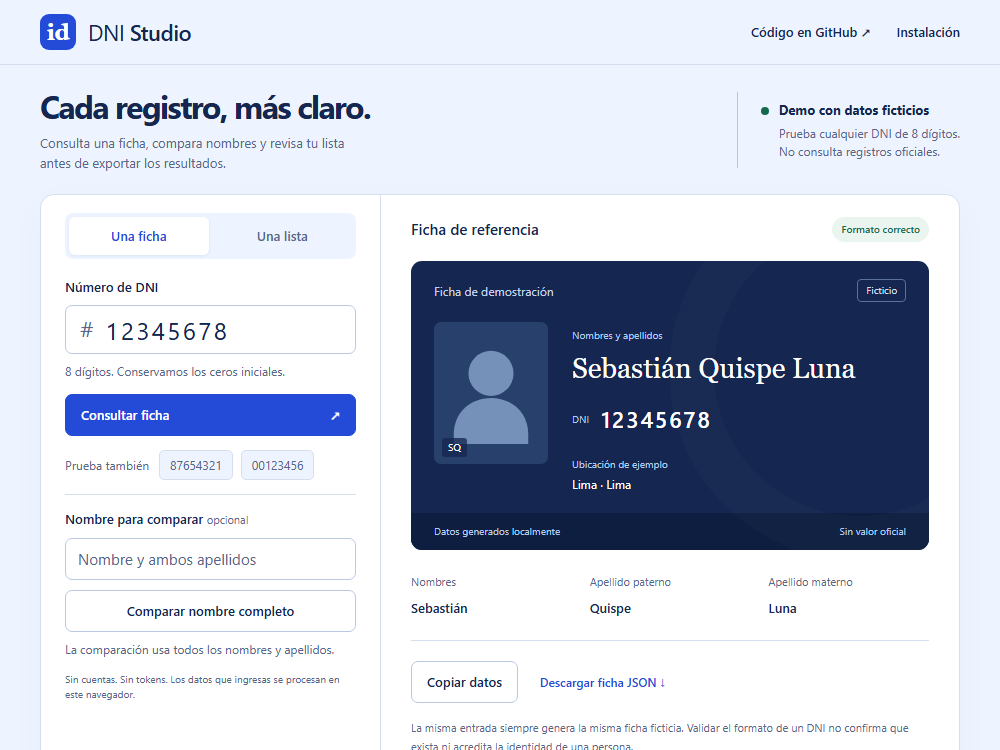
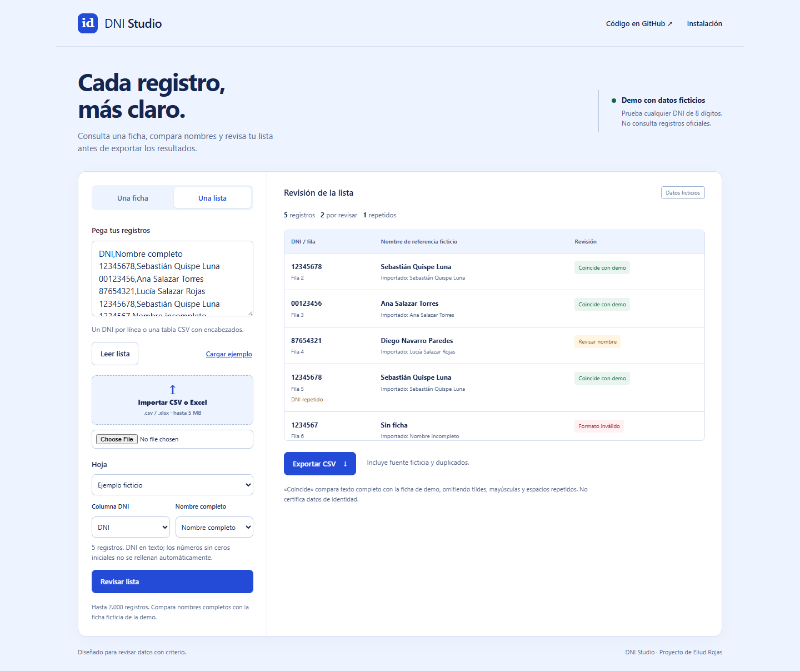

<div align="center">

# DNI Studio

Review individual records and CSV or Excel lists, compare full names and export structured results.

<a href="https://enybyy.github.io/dni-identity-validator/"></a>

<p><a href="https://github.com/Enybyy"></a>
<a href="https://www.linkedin.com/in/eliud-rojas-mendoza-414652212/"></a>
<a href="https://www.upwork.com/freelancers/~01471ca462b236e8e5"></a></p>

[](https://enybyy.github.io/dni-identity-validator/)

*The record uses fictional data. The demo application does not query official registries or authenticate identities.*

[About](#about-the-project) · [Workflow](#everyday-workflow) · [Technology](#built-with) · [Run locally](#local-use)

</div>


## About the project

Before working with a list of people, identifiers need a consistent format, duplicates need attention and names need to be complete. DNI Studio brings these checks into individual and batch views, with CSV or Excel import and sheet and column selection.

Results distinguish rows that need attention and preserve identifiers as text. Review can continue from a structured export, with each warning attached to its record. Names come from a fictional reference: the project demonstrates the review workflow without querying official registries.

## Everyday workflow

| Inside the project | Detail |
| --- | --- |
| Individual record | Eight-digit input, fictional reference and full-name comparison. |
| Batch review | CSV/XLSX import, sheet and column selection, and row-level warnings. |
| Identifiers and duplicates | Preserve leading zeros and flag repeated DNIs. |
| Review output | CSV or JSON export with the data source clearly identified. |

## Screenshots

### List review and export



## Explore the demo

The interface uses Spanish labels:

- **Individual record:** enter exactly eight digits. The same input always generates the same fictional name and preserves leading zeros. Compare a full name, copy the data or download JSON.
- **Batch:** paste one DNI per line or a CSV table with headers, import `.csv` or `.xlsx`, select the sheet and DNI/full-name columns, then select **Revisar lista** (Review list).
- **Results:** distinguish invalid format, names requiring review, matches against the demo and records without a comparison name. Repeated DNIs are flagged. CSV exports identify the fictional source on each row.
- **Examples:** **Cargar ejemplo** (Load example) includes matches, a different name, a duplicate and an incomplete DNI. Sample [CSV](examples/registros.csv) and [two-sheet Excel](examples/registros.xlsx) files are also included.

The first file row must contain headers. The name being compared must be in one column, including given names and both surnames. Comparison ignores accents, case and repeated spaces; matching only the first name is insufficient.

Keep the DNI column as text in Excel. If a workbook has already lost leading zeros, the app reports invalid format instead of inventing missing digits. When reopening CSV in Excel, import this column as text too.

## About the example data

This is a working input, validation, batch review and export flow. **It does not query official registries, verify that a DNI exists or authenticate identities.** All names and locations are fictional. A demo match is a text comparison, not real identity verification. The record design does not represent an official identity card.

The project replaces earlier pages and a provider-specific proxy with an independent static application. A real service integration is outside this version's scope. Credentials for any future integration belong on a private server.

## Built with

| Area | Technology |
| --- | --- |
| Interface and rules | HTML, CSS and JavaScript |
| Files | Local CSV reader and XLSX importer |
| Data | In-memory browser processing with fictional references |
| Demo and verification | GitHub Pages, Node.js and Playwright |

## Local use

<details>
<summary><strong>Run on your computer</strong></summary>

Python 3 serves the files. The application needs no network services, accounts or API keys.

```powershell
git clone https://github.com/Enybyy/dni-identity-validator.git
cd dni-identity-validator
python -m http.server 5082 --bind 127.0.0.1
```

Open `http://127.0.0.1:5082`. To publish the same app, configure GitHub Pages to serve the root of the main branch.

</details>

<details>
<summary><strong>Tests</strong></summary>

Core tests require Node.js 18+ without package installation:

```powershell
node --test tests/core.test.cjs
```

Browser verification requires Playwright and Chromium. With the local server running:

```powershell
npm install --no-save --package-lock=false playwright
npx playwright install chromium
node tests/browser.cjs
```

If Playwright is installed elsewhere, set `PLAYWRIGHT_MODULE` to its path. The browser test captures the actual interface. Regenerate the test workbook with `python tests/make_fixture.py`. Prior verification covered five core tests and the full browser flow; see [evidence and limits](docs/verification.md).

</details>

<details>
<summary><strong>Files and import limits</strong></summary>

```text
index.html                 application and accessible controls
assets/core.js             format checks, fictional data, CSV and comparison
assets/xlsx.js             bounded local XLSX importer
assets/app.js              interaction, mapping and exports
assets/style.css           responsive design
assets/screenshots/        authentic README and portfolio screenshots
examples/                  CSV and XLSX demonstration lists
tests/                     reproducible tests
docs/                      design and verification evidence
```

The XLSX importer reads shared strings, inline strings and saved values. It does not execute macros, evaluate formulas or use cell styles to transform numbers. Limits: 5 MB per file, 20 MB of unpacked content, 2,000 records and 100 columns. Convert `.xls` to `.xlsx`; use CSV if the browser lacks compatible decompression support.

Data stays in browser memory, without `localStorage` persistence or API transmission. Imported content is inserted as text. Export neutralizes prefixes that spreadsheets could interpret as formulas.

</details>

<details>
<summary><strong>Portfolio screenshots</strong></summary>

| File | Use |
| --- | --- |
| [portfolio-1000x750.png](assets/screenshots/portfolio-1000x750.png) | 4:3 record view for a portfolio gallery |
| [desktop.png](assets/screenshots/desktop.png) | Full desktop application |
| [batch.png](assets/screenshots/batch.png) | List review and export |

Suggested caption: “DNI Studio: a record review web demo with CSV/Excel import, full-name comparison, duplicate detection and export. Fictional data; no official registry queries.”

</details>

---

<div align="center">

**Eliud Rojas Mendoza · Enybyy**

<p><a href="https://github.com/Enybyy"></a>
<a href="https://www.linkedin.com/in/eliud-rojas-mendoza-414652212/"></a>
<a href="https://www.upwork.com/freelancers/~01471ca462b236e8e5"></a></p>

</div>
